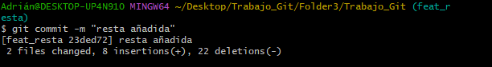
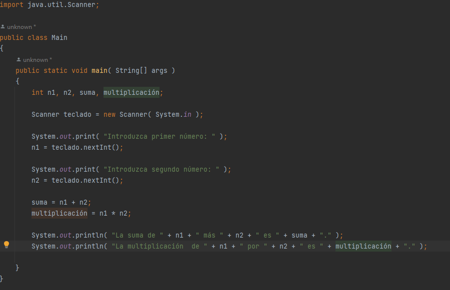
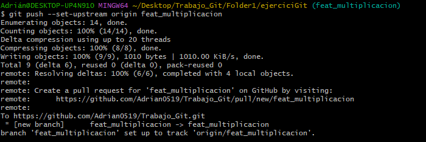

1. Creamos dos carpetas (Folder1 y Folder3) que simularán dos equipos.
    - En este archivo se explicarán todos los pasos que se han ido haciendo con las capturas de los 
      comandos correspondientes.
    - Una carpeta "imagenes" donde se guardarán las capturas de los comandos.

2. Creamos un repositorio de GitHub con el nombre "Trabajo_Git".

3. Creamos un proyecto en el IDE de IntelliJ con el repositorio de Git y un archivo que contenga
   un código de ejemplo (en este caso será un código que realice una suma).

   

   Esto sería un ejemplo de código que ejecuta la suma de 2 números.

   

4. Creamos un README.md de manera local desde el proyecto del intelliJ.

5. Ejecutamos los comandos de git para hacer un commit y un push de la primera parte del proyecto (desde la carpeta Folder1); como es la primera vez que se hace algún cambio en el repositorio, tendremos que ejecutar los comandos que se indican en las siguientes capturas, en los que también iniciamos el repositorio dentro del directorio.

6. El siguiente paso que tendremos que hacer es desde el folder3, clonar el proyecto que ya tenemos y abrirlo.

AVISO: una vez ejecutado el comando "git clone", ten en cuenta que se va a crear una carpeta con los archivos dentro, por lo tanto DEBES EJECUTAR LOS SIGUIENTES COMANDOS DESDE DENTRO DE LA CARPETA CREADA.

7. A continuación tendremos que crear una nueva rama (feat_resta) para añadir y guardar la nueva funcionalidad del proyecto.

8. Escribimos el código necesario para implementar la función de resta. Quedaría un código parecido al de la siguiente captura.

9. Cuando tengamos escrito el código, subimos la rama al repositorio, para ello, ejecutaremos los siguientes comandos:

10. Lo siguiente que tendremos que hacer desde folder3 será movernos a la rama main para hacer un merge de feat_resta de manera local. Como no hay commits nuevos en main el merge debería hacerse de manera automática y sin  conflictos.

11. El siguiente paso que tendremos que hacer será un push de master con los nuevos cambios añadidos.

12. A continuación desde folder1 comprobamos el estado de nuestro proyecto ejecutando el comando "git status", al no indicarnos que el master local está por detrás del remoto, ejecutamos el comando "git fetch".

13. Para poder trabajar desde folder1 debemos ejecutar el comando "git pull", pero vamos a probar que pasaría si no lo hiciéramos. Para ello, añadiremos una nueva funcionalidad al código (funcionalidad de multiplicación en nuestro caso) y esto tendremos que hacerlo en una nueva rama llamada feat_multiplicacion. 

Cuando intentemos hacer un commit del workspace nos saldrá un error que resolveremos en el siguiente paso.

14. Una vez tengamos escrito el código fuente con la funcionalidad añadida, tendremos que ejecutar el comando "git rm" para eliminar el archivo workspace. Este comando hace que el archivo sobre el cual lo usemos, es como si nunca le hubiésemos hecho un "git add".

15. Lo siguiente que tendremos que hacer es ejecutar el "git commmit" para confirmar los cambios que queremos subir al repositorio.

16. Ahora veremos todas las ramas existentes en nuestro repositorio.

17. Lo siguiente que tenemos que hacer es movernos a la rama main.

18. Ahora intentamos ejecutar el comando "git push".

Nos damos cuenta de que nos da error porque no hemos descargado los cambios que habíamos hecho en el otro folder.

19. Podríamos hacer un pull, que implicaría un merge de la rama remota a la rama local, pero para hacerlo bien, vamos a eliminar los nuevos commits de master. Para ello, ejecutamos el comando "git reset --hard" desde master, para volver al último commit hecho en remoto (first commit).

20. El siguiente paso que tenemos que hacer será hacer un merge de la rama feat_multiplicacion.

21. Al ejecutar el comando "git diff" y abrir el archivo en un editor de texto, nos aparecerán unas marcas como las que se ven en la siguiente captura. Estas marcas indican los cambios que hay en la rama actual y también, los cambios existentes en la rama remota.

22. Una vez que hayamos decidido qué cambios queremos mantener, procederemos a editar el archivo manualmente de manera que quede a nuestro gusto.

23. Una vez que hayamos editado el archivo ya estaría resuelto el merge con conflictos. Por último tendremos que ejecutar el comando "git add" para añadir el archivo con los cambios que acabamos de hacer; y seguido, ejecutaremos los comandos "git commit" y "git push" para confirmar los cambios y subirlos al repositorio.

24. Una vez hayammos ejecutado estos comandos podemos ver en el repositorio que todo ha funcionado.

NOTA: con master y main se refieren a la misma rama. Estos nombre varían según la configuración del repositorio.